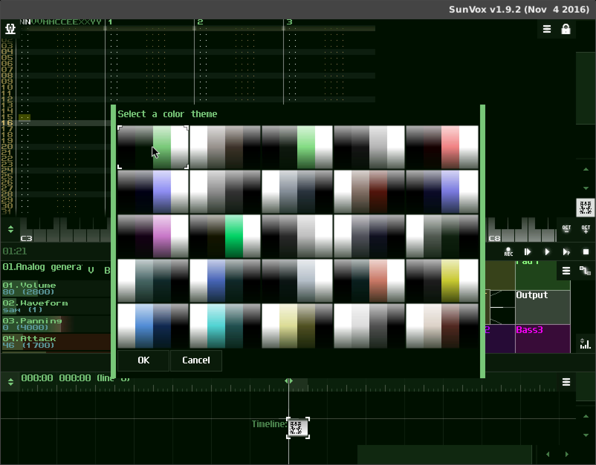
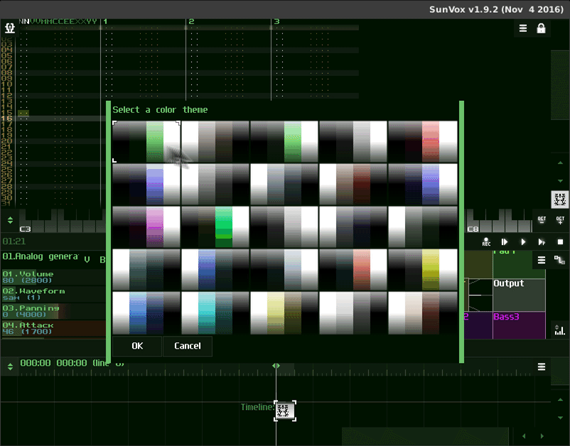
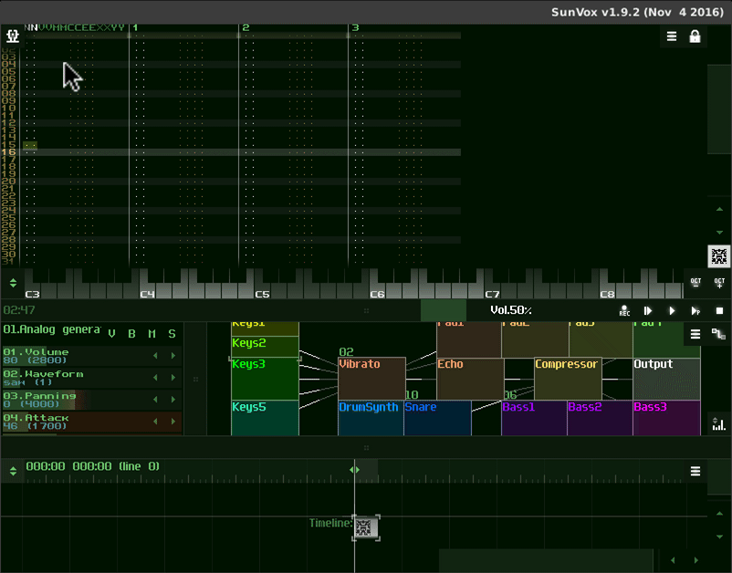

============================
Choosing a color theme [WIP]
============================

When you start SunVox the first time, you are asked to choose a color theme.
Select a color scheme and click OK.

    SunVox color theme selection window.

If you choose a color scheme other than the default, you'll be asked to restart SunVox.

    Selecting a new color theme.

To choose a new color theme, use the main menu to select *Preferences*.
Choose the *Interface* section, then click *Color theme*.

    Opening the color theme picker.

----

..  rubric:: Contributors to this page

Author(s)
  Matthew Scott
